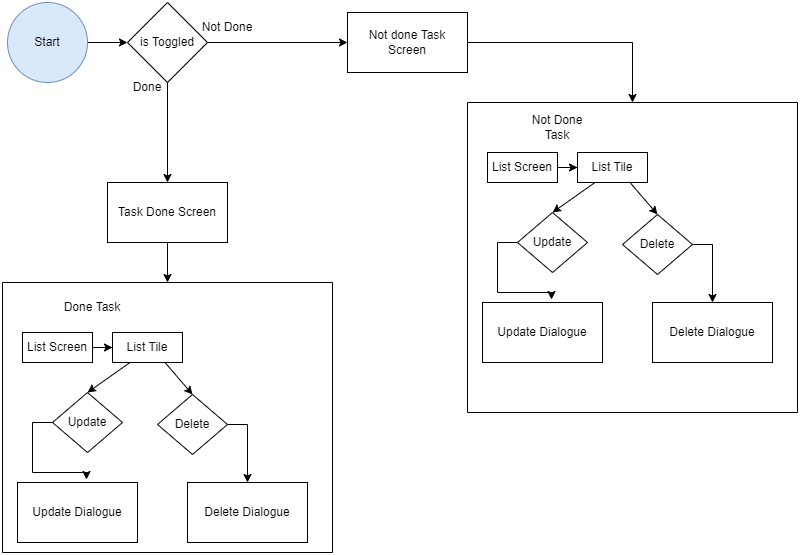
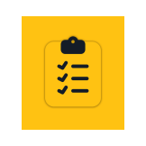

# to_do_app
A new Flutter project. Which can help you to take care of your task that you want to make sure have
been done or not.

You don't need internet to use this application. Your tasks are stored on your cell phone which is very safe that no one is having access to them in any way.
We have used sqflite's local server to store list of task in it.

### User Flow Diagram

### Use Cases
In this app you can 
1. add
2. delete
3. mark as done/not done
4. pick time and date both
5. update tasks in means of date,time,name,etc.
6. Have a list of tasks as well

### Use Case and Description

1. #### Add task
    This feature of this app is going to help you to keep account of your tasks that you want to do or you would be doing in future. You can also add
time and date of the task that needs to be done or you did.
2. #### Delete
    Delete feature of this app helps you to delete the tasks and clear clutter. You can delete from both done and not done task. You will have an alet
once you click on delete button and it will ask you that are you sure that you want to delete this task.
3. #### Mark as done/not done.
    Mark as done is one of the feature that you can say is most important and the main feature of this app. You can mark those task done that you have
completed and you can also mark tasks as not done. One you change their property they will be removed from the current screen and will switch to other
relevant screen.
4. #### Update
    You can update task as you wish to. Like if you want to change the time of a task that you want to postponed to another time then you can. You can 
also change its date and its title etc as well.
5. #### List of tasks
    You will be able to see a task list in your screen which will help you to check all the task and you can change their property from that list as well.

### Watch a video to understand flow of app.

