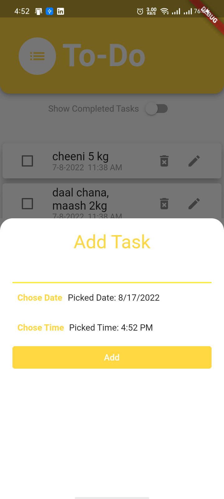
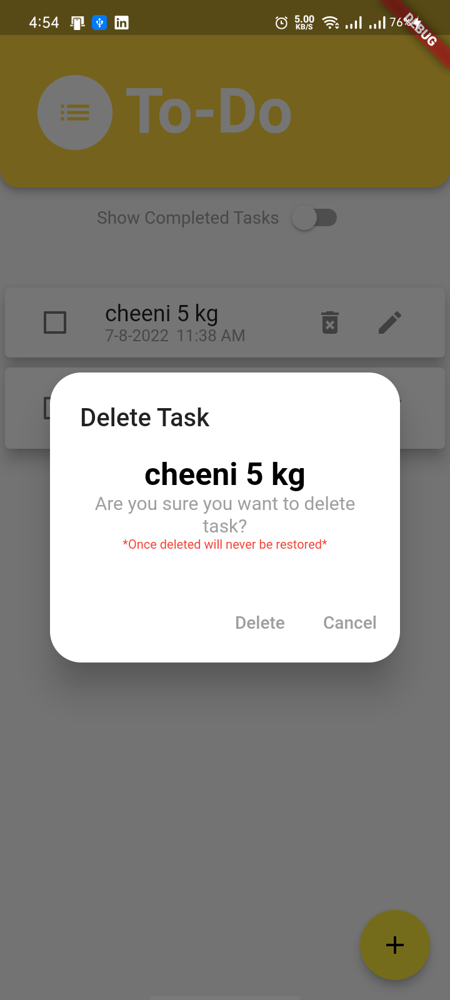
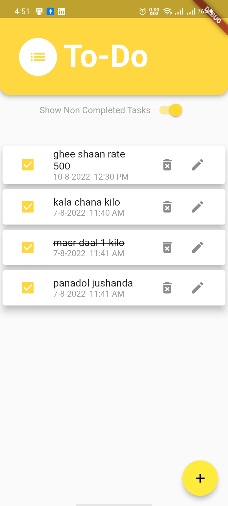
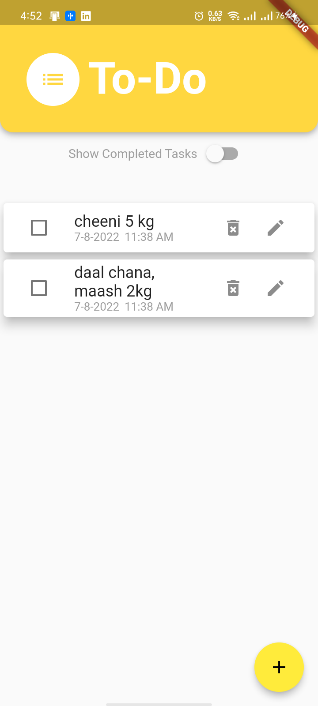
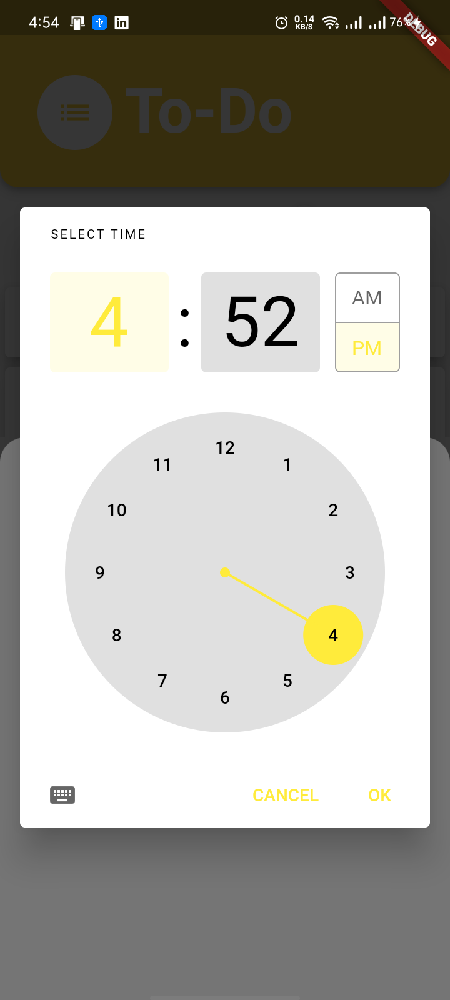
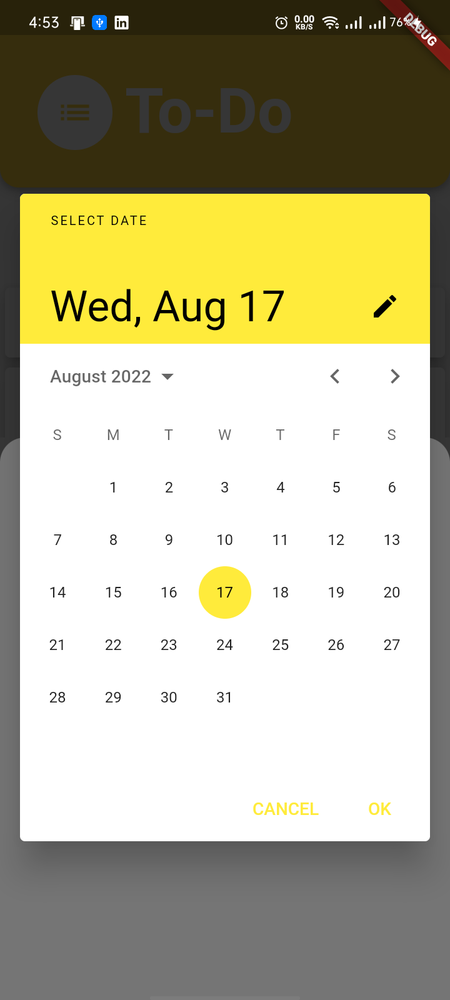
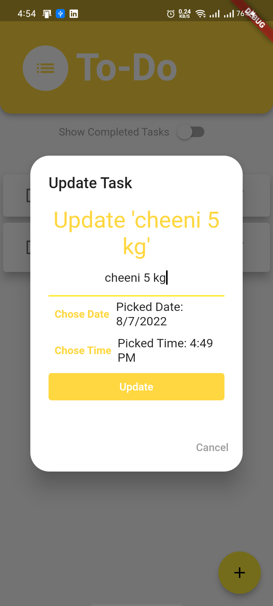

# to_do_app
A new Flutter project. Which can help you to take care of your task that you want to make sure have
been done or not.

You don't need internet to use this application. Your tasks are stored on your cell phone which is very safe that no one is having access to them in any way.
We have used sqflite's local server to store list of task in it.

### User Flow Diagram

### Use Cases
In this app you can 
1. add
2. delete
3. mark as done
4. mark as not done
5. pick time and date both
6. update tasks in means of date,time,name,etc.
7. Have a list of tasks as well

### Use Case and Description

Application will perform following operations on tasks add,delete,update,mark as don,mark as not done.

Application will have a list of task both separately done and not done.

Application will be able to toggle between done and not done tasks.

In this app you can add

,delete 

,mark as done 

 and mark as not done as well 
 
 You can also pick time and date both as well  

User also have to ability to update his tasks in means of date,time,name,etc. 

